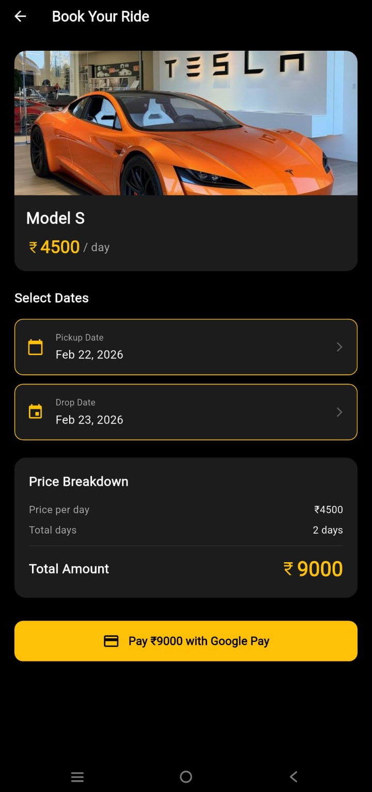
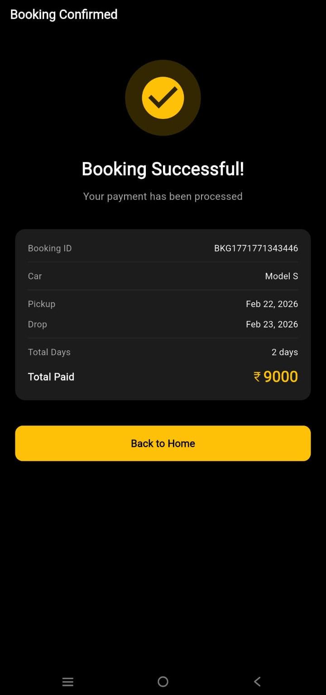
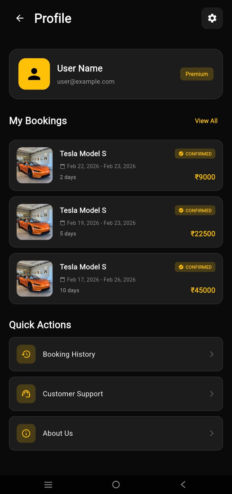

# Flutter Car Rental App

A simple **Car Rental Mobile Application UI** built using Flutter.

This project was created as a college assignment to demonstrate:

- Clean UI Design
- Navigation between screens
- Reusable widgets
- Flutter frontend development

---

## 🚗 Features

- Browse available cars
- View car details
- Simple booking interface
- Modern UI layout
- Responsive design

---

---

## 📸 App Screenshots

### Splash Screen


### Home Screen


### Car Details Screen


### Booking Screen



### Confirmation Screen



### Profile Screen



## 🛠️ Tech Stack

- Flutter
- Dart
- Material Design

---

## 📂 Project Structure

lib/
├── screens/
├── widgets/
├── main.dart

---

## ▶️ Getting Started

To run this project:

```bash
flutter pub get
flutter run
```
